# Digital ABD — Functional Requirements Document

| Field | Value |
|---|---|
| **Document ID** | DIGIABD-FRD-001 |
| **Version** | 2.1 |
| **Status** | Living Document — Implementation Aligned |
| **Classification** | Internal — Confidential |
| **Last Updated** | 2026-07-08 |
| **Owner** | Digital ABD Program Team |
| **Approvers** | CTO, Head of Network Operations, Chief Information Security Officer |

---

## Table of Contents

1. [Executive Summary](#1-executive-summary)
2. [Background & Problem Statement](#2-background--problem-statement)
3. [Goals, Objectives & Success Metrics](#3-goals-objectives--success-metrics)
4. [Scope](#4-scope)
5. [Stakeholders & User Personas](#5-stakeholders--user-personas)
6. [Domain Overview](#6-domain-overview)
7. [Functional Requirements](#7-functional-requirements)
8. [Non-Functional Requirements](#8-non-functional-requirements)
9. [Data Model](#9-data-model)
10. [System Architecture](#10-system-architecture)
11. [Technology Stack](#11-technology-stack)
12. [Integration Requirements](#12-integration-requirements)
13. [Workflows](#13-workflows)
14. [Compliance & Regulatory Alignment](#14-compliance--regulatory-alignment)
15. [Security & Access Control](#15-security--access-control)
16. [Implementation Framework](#16-implementation-framework)
17. [Project Plan & Schedule](#17-project-plan--schedule)
18. [Team & Responsibilities](#18-team--responsibilities)
19. [Deliverables & Acceptance Criteria](#19-deliverables--acceptance-criteria)
20. [Risks, Assumptions & Dependencies](#20-risks-assumptions--dependencies)
21. [Glossary](#21-glossary)
22. [Revision History](#22-revision-history)

### Enterprise Architecture & Operations

23. [Enterprise Architecture Principles](#23-enterprise-architecture-principles)
24. [Multi-Tenancy & Organizational Hierarchy](#24-multi-tenancy--organizational-hierarchy)
25. [Service Level Objectives](#25-service-level-objectives)
26. [High Availability & Disaster Recovery](#26-high-availability--disaster-recovery)
27. [Observability & Site Reliability Engineering](#27-observability--site-reliability-engineering)
28. [Event-Driven Architecture](#28-event-driven-architecture)
29. [API Governance & Platform Standards](#29-api-governance--platform-standards)
30. [Data Governance & Master Data Management](#30-data-governance--master-data-management)
31. [Enterprise Security Framework](#31-enterprise-security-framework)
32. [Identity Federation & User Lifecycle](#32-identity-federation--user-lifecycle)
33. [Deployment Topology & Environments](#33-deployment-topology--environments)
34. [Capacity Planning & Performance Engineering](#34-capacity-planning--performance-engineering)
35. [Quality Assurance & Testing Strategy](#35-quality-assurance--testing-strategy)
36. [Change Management & Release Strategy](#36-change-management--release-strategy)
37. [Incident Management & Enterprise Support](#37-incident-management--enterprise-support)
38. [Regulatory & Certification Alignment](#38-regulatory--certification-alignment)
39. [Implementation Status Addendum (v0.4)](#39-implementation-status-addendum-v04)

---

## 1. Executive Summary

**Digital ABD (As-Built Documentation)** is an enterprise-grade, GIS-enabled platform for recording how Optical Fiber Cable (OFC) networks were actually constructed — including deviations from approved design. It replaces fragmented paper-based and siloed digital records with a unified, auditable system of record accessible across construction, operations, compliance, and executive stakeholders.

This document defines functional, non-functional, architectural, operational, and governance requirements for implementing Digital ABD as a **mission-critical enterprise application** supporting multi-operator, multi-vendor, and multi-region OFC programs at national scale.

**Enterprise positioning:**

| Dimension | Target State |
|---|---|
| Scale | 100+ concurrent projects, 50,000+ km of documented routes, 500+ active users |
| Availability | 99.9% platform SLA with geo-redundant deployment |
| Compliance | TEC/DoT aligned; audit-ready; ISO 27001 / SOC 2 Type II roadmap |
| Integration | API-first; event-driven; NOC/ERP/CMDB/GIS enterprise bus compatible |
| Governance | Multi-tenant isolation, data lineage, retention policies, SOX-ready audit trails |
| Operations | 24×7 SRE monitoring, defined incident response, DR tested quarterly |

**Expected outcomes:**

- Reduced MTTR through accurate asset localization
- Improved MTBF traceability via construction-quality records
- Audit-ready compliance with TEC/DoT specifications
- Lower lifecycle CapEx by reducing redundant route investments

---

## 2. Background & Problem Statement

### 2.1 What is Digital ABD?

ABD (As-Built Documentation) is a detailed record of how OFC was actually laid, including deviations from the original design. When digitized using GIS mapping, AutoCAD drawings, and specialized OFC project management tools, it becomes **Digital ABD**.

Digital ABD ensures:

- Transparency and compliance with TEC/DoT specifications
- A durable reference for future expansions, repairs, and audits
- SLA governance through documented trench depth, ducting, HDD crossings, and protective measures

### 2.2 Traditional vs. Digital ABD

| Aspect | Traditional ABD | Digital ABD |
|---|---|---|
| Format | Paper drawings, manual notes | GIS maps, AutoCAD, digital photos |
| Accuracy | Prone to human error | GPS-based precision |
| Accessibility | Limited to physical files | Cloud-based, accessible to all stakeholders |
| Compliance | Harder to audit | Easy to validate against TEC/DoT norms |
| Maintenance | Time-consuming | Faster fault localization and repair |

### 2.3 The Challenging World of OFC

Optical Fiber Communication (OFC) networks are the backbone of hyperscale resilience, but lifecycle revenue is highly sensitive to planning and deployment decisions. **Mean Time Between Failures (MTBF)** and **Mean Time To Repair (MTTR)** are shaped by both design choices and operational practices. Digital ABD bridges the gap between construction records and operational reliability.

**Planning & Deployment Factors (MTBF Driven)**

- **Component Selection**: Armoured OFC, hardware redundancy, and robust power design improve intrinsic reliability.
- **Design Parameters**: Depth of trenching, duct type, and protective measures directly influence MTBF.
- **Verification**: Plan vs. actual checks ensure execution aligns with design intent.

**Operations & Maintenance Factors (MTTR Driven)**

- **Accurate Asset Location**: Digital ABD enables precise identification of routes, manholes, and markers.
- **Root Cause Analysis (RCA) Automation**: Faster diagnosis reduces downtime.
- **Field Repair Team (FRT) Efficiency**: Optimized deployment per km shortens repair cycles.

**Reliability & Revenue Impact**

- Traditional redundancy (2+1) can push availability from **99% (~5,256 min downtime/year)** to **99.9% (~525 min downtime/year)**, but over-investment escalates CapEx and adds latency.
- **Intrinsic reliability improvements (high MTBF, low MTTR)** yield better lifecycle revenue than simply adding redundant routes.
- Shared paths and poor documentation increase maintenance overhead.

**Role of Digital ABD**

- **Addresses Both MTBF & MTTR**: By digitizing trenching, ducting, splicing, and reinstatement records.
- **Live, Task-Managed ABD**: Supports project management, supply chain processes, NOC operations, and proactive fault isolation.
- **Governance Advantage**: Small incremental investments in Digital ABD streamline operations, reduce CapEx, and enhance SLA compliance.

### 2.4 Problem Statement

Organizations lack a single source of truth for as-built OFC records. Field data is fragmented across paper logs, disconnected photo albums, standalone OTDR reports, and CAD files. This fragmentation:

- Delays fault localization during outages
- Complicates regulatory audits and SLA disputes
- Prevents correlation between construction deviations and recurring failures
- Increases cost of brownfield upgrades and route sharing negotiations

---

## 3. Goals, Objectives & Success Metrics

### 3.1 Primary Objective

Establish a **digitized, auditable, and GIS-enabled As-Built Documentation framework** for OFC projects, ensuring compliance, operational efficiency, and lifecycle revenue optimization.

### 3.2 Goals

| ID | Goal | Measurable Target |
|---|---|---|
| G-01 | Complete digital capture of as-built records | ≥ 95% of route segments have full ABD records within 48 hours of construction |
| G-02 | Reduce fault localization time | ≥ 30% reduction in MTTR for documented routes within 12 months |
| G-03 | Audit readiness | 100% of regulatory audit requests fulfilled from the repository without manual reconstruction |
| G-04 | Stakeholder access | Role-based portal access for vendors, inspectors, NOC, and clients |
| G-05 | Plan vs. actual traceability | 100% of recorded deviations linked to approval workflow |
| G-06 | Enterprise scalability | Platform supports 100+ projects without architectural change |
| G-07 | Operational resilience | DR failover validated quarterly; RPO/RTO targets met in drills |
| G-08 | Integration coverage | ≥ 5 enterprise systems integrated via standard APIs/events |
| G-09 | Security posture | Zero critical vulnerabilities at go-live; MFA enforced for privileged roles |
| G-10 | Data governance maturity | 100% of production entities tagged with owner, classification, and retention policy |

### 3.3 KPIs

- **ABD Completeness Score** — % of required fields populated per route segment
- **Geo-accuracy** — % of assets within ≤ 3 m of surveyed GPS coordinates
- **OTDR Linkage Rate** — % of splice joints with attached OTDR test results
- **Deviation Closure Time** — median days from deviation report to approval
- **Portal Uptime** — ≥ 99.9% monthly availability (enterprise SLA)
- **API p99 Latency** — ≤ 500 ms for read operations; ≤ 2 s for complex spatial queries
- **MTBF / MTTR Trend** — tracked per route and aggregated in SLA dashboards
- **Mean Time to Detect (MTTD)** — platform incidents detected within 5 minutes via observability stack
- **Change Failure Rate** — ≤ 5% of production deployments cause incident or rollback
- **Data Quality Score** — % of records passing automated validation rules

---

## 4. Scope

### 4.1 In Scope

- Greenfield OFC deployments and brownfield upgrades
- Survey, trenching, ducting, cable laying, jointing, splicing, reinstatement, and approvals
- Integration with NOC, SCM, and SLA dashboards
- Mobile field capture, web portal, GIS/CAD conversion, and governance workflows

### 4.2 Out of Scope (Phase 1)

- Real-time fiber monitoring / OTDR continuous monitoring (only test-result ingestion)
- Automated network design and route optimization
- Billing and commercial contract management (except SLA metric export)
- Replacement of existing NOC ticketing systems (integration only)
- On-premise primary deployment (Phase 1 is cloud-first; hybrid DR optional in Phase 2)

### 4.3 Enterprise Phasing Roadmap

| Phase | Timeline | Enterprise Capabilities Delivered |
|---|---|---|
| **Phase 1 — Foundation** | Months 1–3 | Core ABD capture, portal, RBAC, single-region HA, NOC integration |
| **Phase 2 — Scale** | Months 4–6 | Multi-tenant isolation, event bus, API gateway, observability stack, SCM integration |
| **Phase 3 — Resilience** | Months 7–9 | Multi-AZ deployment, DR site, automated failover drills, data warehouse ETL |
| **Phase 4 — Governance** | Months 10–12 | SLA/SLO dashboards, advanced analytics, CMDB sync, certification readiness |
| **Phase 5 — Expansion** | Year 2+ | Multi-region, AI-assisted RCA, predictive maintenance signals, partner API marketplace |

### 4.4 Assumptions

- Vendors and field teams have smartphones or rugged tablets with GPS capability
- Approved design drawings (planned route) are available in CAD or GIS format before construction
- TEC/DoT compliance standards are defined and accessible to the program team
- Stakeholders agree on a single cloud provider and identity provider for Phase 1

---

## 5. Stakeholders & User Personas

| Persona | Role | Primary Needs |
|---|---|---|
| **Field Engineer** | Captures trenching, ducting, splicing data on-site | Offline-capable mobile app, photo upload, GPS tagging |
| **Site Supervisor** | Reviews and submits daily ABD packages | Task lists, deviation reporting, sign-off workflow |
| **QA / Inspector (OIC)** | Verifies compliance, approves deviations | Checklists, comparison to design, audit trail |
| **GIS / CAD Engineer** | Converts field data to maps and drawings | ETL tools, layer management, metadata tagging |
| **NOC Operator** | Uses ABD for fault localization | Route search, manhole/closure lookup, map overlay |
| **Program Manager** | Tracks project progress and SLA metrics | Dashboards, completeness reports, escalation views |
| **Regulator / Client Auditor** | Read-only compliance review | Immutable records, exportable audit packages |
| **Vendor Admin** | Manages vendor team access and submissions | RBAC, bulk upload, contract-scoped data visibility |
| **Enterprise Admin** | Configures tenants, integrations, policies | Tenant provisioning, SSO config, data retention policies |
| **Data Steward** | Owns data quality and master data standards | Data catalog, quality rules, lineage review |
| **SRE / Platform Operator** | Monitors platform health and incidents | Dashboards, alerts, runbooks, capacity reports |
| **Executive Sponsor** | Portfolio-level visibility | Executive dashboards, ROI metrics, compliance posture |

---

## 6. Domain Overview

### 6.1 Components of Digital ABD

#### 6.1.1 Route & Survey Data

- GPS/GIS coordinates of the fiber route
- Alignment sheets and survey drawings
- Details of trenching path (road, shoulder, rural, urban)

#### 6.1.2 Trenching & Ducting Details

- Depth and width of trench (typically 1.65 m depth per TEC norms; configurable per project)
- Type of duct used (HDPE, DWC, RCC)
- Bedding and protective layers (sand, bricks, concrete)
- HDD (Horizontal Directional Drilling) crossing details

#### 6.1.3 Cable & Jointing Records

- Fiber cable specifications (type, core count, sheath)
- Joint locations and closure details
- Splicing records and OTDR test results

#### 6.1.4 Crossings & Special Structures

- Railway, highway, canal, and river crossings
- Culverts, bridges, and utility corridors
- Protection measures (GI pipes, RCC hume pipes, encasements)

#### 6.1.5 Photographic Evidence

- Geo-tagged photos of trenching, ducting, jointing, and reinstatement
- Before/after images for compliance

#### 6.1.6 Compliance & Approvals

- Deviations from design with justification
- Officer-in-Charge (OIC) approvals and inspection notes
- Safety and reinstatement certificates

#### 6.1.7 Digital Conversion

- AutoCAD drawings of actual route
- GIS mapping layers with metadata
- Cloud-based repository for stakeholder access

### 6.2 Inputs Required

| Input Category | Data Elements | Source |
|---|---|---|
| Survey Data | GPS/GIS coordinates, alignment sheets | Field survey teams, GIS tools |
| Trenching & Ducting | Depth, width, duct type, HDD crossings | Mobile field app |
| Cable Records | Fiber specs, joint closures, OTDR reports | Field teams, test equipment |
| Crossings | Railway, highway, canal, culvert details | Field app + design drawings |
| Photographic Evidence | Geo-tagged before/after images | Mobile camera + GPS |
| Compliance | Deviations, approvals, reinstatement certificates | Workflow system |
| Digital Conversion | AutoCAD drawings, GIS layers | CAD/GIS engineers |

---

## 7. Functional Requirements

Requirements use the convention **FR-xxx**. Priority: **P0** (must-have for launch), **P1** (should-have), **P2** (nice-to-have).

### 7.1 Field Data Capture

| ID | Requirement | Priority |
|---|---|---|
| FR-001 | The system shall allow field engineers to create route segments linked to an approved project and design route. | P0 |
| FR-002 | The mobile app shall capture GPS coordinates (lat/long/altitude) with configurable accuracy thresholds. | P0 |
| FR-003 | The mobile app shall support offline data capture with automatic sync when connectivity is restored. | P0 |
| FR-004 | The system shall record trenching attributes: depth, width, surface type, bedding material, and reinstatement status. | P0 |
| FR-005 | The system shall record ducting attributes: duct type (HDPE/DWC/RCC), count, diameter, and protection method. | P0 |
| FR-006 | The system shall record HDD crossing details: entry/exit coordinates, bore length, depth, and pipe specification. | P0 |
| FR-007 | The system shall attach geo-tagged photos with mandatory metadata: timestamp, coordinates, capture phase (before/during/after), and linked asset. | P0 |
| FR-008 | The system shall record cable specifications: manufacturer, core count, sheath type, drum number, and laid length. | P0 |
| FR-009 | The system shall record joint/closure locations with type, splice count, and technician identity. | P0 |
| FR-010 | The system shall accept OTDR test result uploads (PDF/CSV) linked to splice joints or route spans. | P0 |
| FR-011 | The system shall flag incomplete ABD packages before submission (missing mandatory fields or photos). | P0 |
| FR-012 | The mobile app shall support barcode/QR scanning for drum and closure asset tags. | P1 |

### 7.2 Deviation & Approval Management

| ID | Requirement | Priority |
|---|---|---|
| FR-020 | The system shall allow recording of deviations from approved design with category, description, justification, and supporting evidence. | P0 |
| FR-021 | The system shall route deviation records through a configurable approval workflow (Supervisor → OIC). | P0 |
| FR-022 | The system shall maintain a full audit trail of approval actions (who, when, decision, comments). | P0 |
| FR-023 | The system shall visually overlay planned vs. actual route on GIS maps. | P0 |
| FR-024 | The system shall block final ABD sign-off for segments with open, unapproved deviations. | P1 |
| FR-025 | The system shall support digital signature or OTP-based sign-off for OIC approvals. | P1 |

### 7.3 Repository & Search

| ID | Requirement | Priority |
|---|---|---|
| FR-030 | The system shall provide a centralized cloud repository for all ABD artifacts (spatial data, CAD, photos, OTDR, certificates). | P0 |
| FR-031 | The system shall support search by project, route, chainage, asset type, manhole ID, closure ID, and geographic bounding box. | P0 |
| FR-032 | The system shall version all records; prior versions shall remain accessible for audit. | P0 |
| FR-033 | The system shall export audit packages (ZIP/PDF report + GIS layer) for a given route or project. | P0 |
| FR-034 | The system shall support bulk import of legacy ABD data (CAD, shapefiles, scanned documents). | P1 |

### 7.4 GIS & CAD Conversion

| ID | Requirement | Priority |
|---|---|---|
| FR-040 | The system shall generate GIS layers for route centerline, manholes, closures, crossings, and HDD segments. | P0 |
| FR-041 | The system shall support export to standard formats: GeoJSON, Shapefile, KML, and WMS/WFS services. | P0 |
| FR-042 | The system shall produce as-built AutoCAD drawings from field-captured data via ETL workflows. | P0 |
| FR-043 | The system shall tag all GIS features with metadata: project ID, segment ID, construction date, vendor, and compliance status. | P0 |
| FR-044 | The system shall reconcile field GPS traces with approved alignment sheets and highlight variances > configurable tolerance (default 5 m). | P1 |

### 7.5 Governance, SLA & NOC Integration

| ID | Requirement | Priority |
|---|---|---|
| FR-050 | The system shall expose ABD completeness and compliance dashboards per project and vendor. | P0 |
| FR-051 | The system shall integrate with NOC systems to provide route/asset lookup during fault tickets. | P0 |
| FR-052 | The system shall feed MTBF/MTTR metrics to SLA dashboards. | P0 |
| FR-053 | The system shall support configurable escalation matrices triggered by SLA breaches or open deviations. | P1 |
| FR-054 | The system shall provide RCA hints by correlating fault location with nearby construction deviations or crossing types. | P1 |
| FR-055 | The system shall publish alerts when ABD completeness falls below configurable thresholds. | P1 |

### 7.6 Administration

| ID | Requirement | Priority |
|---|---|---|
| FR-060 | The system shall support role-based access control (RBAC) with project-scoped and vendor-scoped visibility. | P0 |
| FR-061 | The system shall allow administrators to configure mandatory field checklists per project type (urban/rural/HDD-heavy). | P0 |
| FR-062 | The system shall support multi-tenant project isolation in a shared deployment. | P1 |
| FR-063 | The system shall provide training-mode sandbox environments for vendor onboarding. | P2 |

### 7.7 Enterprise Platform Capabilities

| ID | Requirement | Priority |
|---|---|---|
| FR-070 | The system shall support hierarchical multi-tenancy: Organization → Business Unit → Project → Route. | P0 |
| FR-071 | The system shall enforce tenant-level data isolation at the database and API layers with no cross-tenant data leakage. | P0 |
| FR-072 | The system shall publish domain events (segment completed, deviation approved, asset updated) to an enterprise message bus. | P0 |
| FR-073 | The system shall expose a centralized API gateway with OAuth 2.0, rate limiting, request logging, and API key management. | P0 |
| FR-074 | The system shall support configurable data retention and legal hold policies per tenant and project. | P0 |
| FR-075 | The system shall provide a data catalog with searchable metadata, ownership, classification, and lineage for all entities. | P1 |
| FR-076 | The system shall support delegated administration: tenant admins manage users within their org without global admin access. | P0 |
| FR-077 | The system shall provide executive dashboards with portfolio-level KPIs across tenants and regions. | P1 |
| FR-078 | The system shall support bulk operations API for enterprise migrations (≥ 10,000 records per batch). | P1 |
| FR-079 | The system shall implement idempotent APIs for all write operations to support safe retries. | P0 |
| FR-080 | The system shall support feature flags for controlled rollout of new capabilities per tenant. | P1 |

### 7.8 Notifications & Collaboration

| ID | Requirement | Priority |
|---|---|---|
| FR-090 | The system shall send notifications via email, SMS, and in-app channels for approvals, SLA breaches, and sync failures. | P0 |
| FR-091 | The system shall integrate with enterprise collaboration tools (Microsoft Teams / Slack) for alert routing. | P1 |
| FR-092 | The system shall maintain an activity feed per project showing all stakeholder actions chronologically. | P1 |
| FR-093 | The system shall support @mentions and task assignments within approval workflows. | P2 |
| FR-094 | The system shall provide configurable notification preferences per user and role. | P1 |

---

## 8. Non-Functional Requirements

| ID | Category | Requirement |
|---|---|---|
| NFR-001 | Availability | Portal and API uptime ≥ 99.9% monthly (excluding planned maintenance). |
| NFR-002 | Performance | Route search and map load ≤ 3 seconds for projects up to 500 km. |
| NFR-003 | Performance | Photo upload shall support files up to 25 MB with resumable upload. |
| NFR-004 | Scalability | Support ≥ 50 concurrent field users and ≥ 10,000 route segments per project. |
| NFR-005 | Geo-accuracy | GPS coordinates stored with minimum 6 decimal places; accuracy metadata captured per reading. |
| NFR-006 | Security | All data encrypted in transit (TLS 1.2+) and at rest (AES-256). |
| NFR-007 | Security | MFA required for admin and OIC roles. |
| NFR-008 | Auditability | All create/update/delete operations logged with user, timestamp, and IP. |
| NFR-009 | Data Retention | ABD records retained for minimum 10 years; configurable per contract. |
| NFR-010 | Offline | Mobile app shall operate offline for ≥ 8 hours of typical field use. |
| NFR-011 | Interoperability | REST APIs with OpenAPI 3.0 specification; webhook support for NOC events. |
| NFR-012 | Accessibility | Web portal WCAG 2.1 Level AA compliance for dashboard and search interfaces. |
| NFR-013 | Localization | English primary; Hindi optional for field app labels (Phase 2). |
| NFR-014 | Disaster Recovery | RPO ≤ 15 minutes, RTO ≤ 1 hour for production (active-passive multi-AZ). |
| NFR-015 | Availability | 99.9% uptime SLA (≤ 43.8 min unplanned downtime/month). |
| NFR-016 | Scalability | Horizontal auto-scaling for API and worker tiers; support 500 concurrent users. |
| NFR-017 | Scalability | Support ≥ 100 active projects and ≥ 50,000 km total documented routes. |
| NFR-018 | Maintainability | All services containerized; infrastructure as code (Terraform/Pulumi). |
| NFR-019 | Observability | 100% of services emit structured logs, metrics, and distributed traces. |
| NFR-020 | Security | Annual penetration test; quarterly vulnerability scans; CVE remediation within SLA by severity. |
| NFR-021 | Security | Secrets managed via vault (HashiCorp Vault / cloud KMS); no secrets in code or config files. |
| NFR-022 | Compliance | Data residency: primary storage within India region; cross-border transfer requires explicit policy. |
| NFR-023 | Compliance | Right-to-erasure support for PII with audit log of erasure actions (where legally applicable). |
| NFR-024 | Reliability | Zero-downtime deployments for stateless services via rolling updates. |
| NFR-025 | API | Backward-compatible API versioning; minimum 12-month deprecation notice for breaking changes. |
| NFR-026 | Data Integrity | Checksums (SHA-256) on all uploaded files; integrity verified on retrieval. |
| NFR-027 | Backup | Point-in-time recovery for database (≥ 35 days); object storage versioning enabled. |
| NFR-028 | Performance | API gateway throughput ≥ 2,000 requests/second at peak load. |

---

## 9. Data Model

### 9.1 Core Entities

```
Project
  └── Route
        └── Segment (chainage-based)
              ├── SurveyPoint
              ├── TrenchRecord
              ├── DuctRecord
              ├── HDDCrossing
              ├── CableLayRecord
              ├── JointClosure
              │     └── OTDRTest
              ├── Crossing (railway/highway/canal/etc.)
              ├── PhotoEvidence
              ├── Deviation
              │     └── ApprovalAction
              └── ComplianceCertificate
```

### 9.2 Entity Definitions

| Entity | Key Attributes | Relationships |
|---|---|---|
| **Project** | project_id, name, client, vendor, start_date, status, design_route_ref | Has many Routes |
| **Route** | route_id, project_id, name, total_length_km, status | Has many Segments |
| **Segment** | segment_id, route_id, chainage_start, chainage_end, surface_type, status | Has trench, duct, cable, photos |
| **SurveyPoint** | point_id, segment_id, geometry (Point), accuracy_m, captured_at | Belongs to Segment |
| **TrenchRecord** | trench_id, depth_m, width_m, bedding_type, reinstatement_status | Belongs to Segment |
| **DuctRecord** | duct_id, duct_type, diameter_mm, count, protection_method | Belongs to Segment |
| **HDDCrossing** | hdd_id, entry_point, exit_point, bore_length_m, pipe_spec | Belongs to Segment |
| **CableLayRecord** | cable_id, core_count, sheath_type, drum_number, laid_length_m | Belongs to Segment |
| **JointClosure** | closure_id, geometry, closure_type, splice_count, technician_id | Has OTDRTests |
| **OTDRTest** | test_id, closure_id, file_ref, result_summary, test_date | Belongs to JointClosure |
| **Crossing** | crossing_id, crossing_type, protection_measure, approval_ref | Belongs to Segment |
| **PhotoEvidence** | photo_id, geometry, phase, file_ref, linked_entity_type/id | Polymorphic link |
| **Deviation** | deviation_id, category, description, justification, status | Has ApprovalActions |
| **ApprovalAction** | action_id, deviation_id, actor, decision, timestamp, comments | Belongs to Deviation |

### 9.3 Spatial Data Standards

- Coordinate Reference System: **WGS 84 (EPSG:4326)** for storage; project-specific projected CRS for engineering drawings
- Geometry types: `Point` (assets, photos), `LineString` (route centerline, trench path), `Polygon` (work zones)
### 9.4 Enterprise Extensions

| Entity | Key Attributes | Purpose |
|---|---|---|
| **Organization** | org_id, name, tier, data_residency_region, retention_policy | Top-level tenant |
| **BusinessUnit** | bu_id, org_id, name, cost_center | Internal organizational grouping |
| **TenantConfig** | config_id, org_id, feature_flags, notification_rules, branding | Per-tenant platform configuration |
| **AssetMaster** | asset_id, type, serial_number, manufacturer, warranty_expiry | Enterprise asset registry (cable drums, closures) |
| **IntegrationEndpoint** | endpoint_id, org_id, system_type, credentials_ref, status | Registered enterprise integrations |
| **AuditLog** | log_id, entity_type, entity_id, action, actor, timestamp, before/after hash | Immutable audit trail |
| **DataLineage** | lineage_id, source_system, target_entity, transformation, timestamp | Data provenance tracking |
| **LegalHold** | hold_id, project_id, reason, placed_by, expiry | Prevents deletion during litigation/audit |

### 9.5 Data Classification

| Classification | Examples | Handling Requirements |
|---|---|---|
| **Public** | Published route maps (approved for sharing) | Standard encryption; CDN cacheable |
| **Internal** | Project schedules, completeness scores | RBAC; encrypted at rest |
| **Confidential** | Vendor contracts, deviation justifications | RBAC + MFA; no external sharing |
| **Restricted** | OTDR results, regulatory submissions, PII | RBAC + MFA + audit; field-level encryption for PII |
| **Critical Infrastructure** | Full network route GIS for operational networks | Highest protection; NOC-only real-time access |

---

## 10. System Architecture

Data flows upward from field capture through storage and processing to governance, ensuring traceability, compliance, and lifecycle visibility.

### 10.1 Architecture Layers

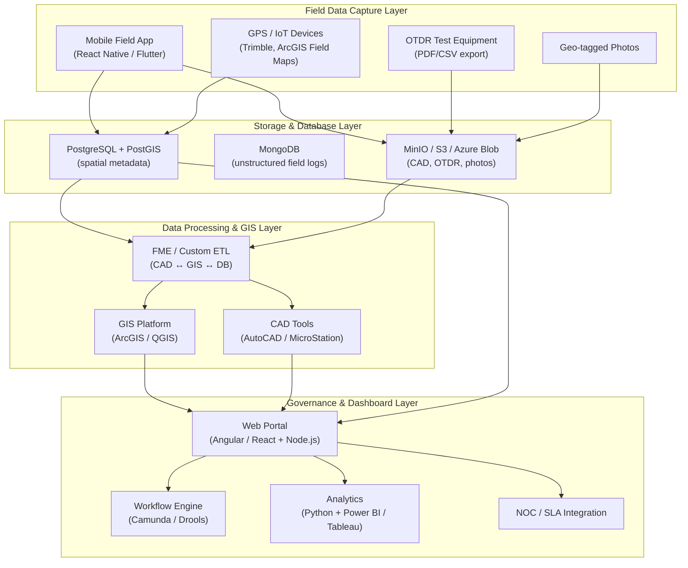

### 10.2 Layer Descriptions

| Layer | Components | Responsibility |
|---|---|---|
| **Field Data Capture** | Mobile app, GPS devices, OTDR exports, camera | Real-time and offline capture of construction data |
| **Storage & Database** | PostgreSQL + PostGIS, MongoDB, object storage (MinIO/S3) | Durable storage for spatial, structured, and unstructured data |
| **Data Processing & GIS** | ETL (FME), GIS platform, CAD tools | Conversion, reconciliation, and layer generation |
| **Governance & Dashboard** | Web portal, workflow engine, analytics, NOC integration | Access control, SLA monitoring, compliance, and escalation |

### 10.3 Reference Architecture Diagram

*Figure 1: High-level architecture — Field Capture → Storage → Processing → Governance*

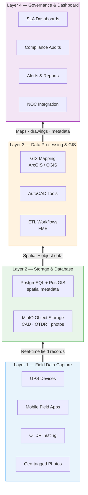

### 10.4 Enterprise Component Architecture

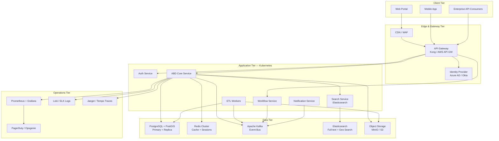

### 10.5 Architecture Decision Records (Key ADRs)

| ADR | Decision | Rationale |
|---|---|---|
| ADR-001 | API-first, event-driven microservices | Enables enterprise integration without tight coupling |
| ADR-002 | PostgreSQL + PostGIS as system of record | ACID compliance, mature spatial indexing, enterprise DBA familiarity |
| ADR-003 | Kafka for domain events | Durable, replayable event stream for NOC, analytics, and audit consumers |
| ADR-004 | Kubernetes on cloud-managed service (EKS/AKS/GKE) | Standardized deployment, auto-scaling, enterprise support contracts |
| ADR-005 | OIDC/SAML federation over custom auth | Enterprise SSO, SCIM provisioning, reduced identity sprawl |
| ADR-006 | India-region primary with cross-region DR | Meets data residency; satisfies enterprise DR requirements |
| ADR-007 | Append-only audit log over blockchain default | Lower TCO; sufficient tamper evidence with checksums and RBAC |

---

## 11. Technology Stack

### 11.1 Data Capture Layer

| Component | Technology | Purpose |
|---|---|---|
| Mobile Field App | React Native / Flutter | Real-time capture of trenching, ducting, splicing, geo-tagged photos |
| IoT/GPS Devices | Trimble GPS, ESRI ArcGIS Field Maps | Precision route mapping and asset location tagging |

### 11.2 Data Storage & Processing

| Component | Technology | Purpose |
|---|---|---|
| Spatial Database | PostgreSQL + PostGIS | Spatial data storage and queries |
| Document Store | MongoDB | Flexible storage for unstructured field logs |
| Object Storage | MinIO / Azure Blob / AWS S3 / GCS | CAD drawings, OTDR reports, images |

### 11.3 Digital Conversion & Mapping

| Component | Technology | Purpose |
|---|---|---|
| GIS Platform | ESRI ArcGIS / QGIS (open-source) | Route visualization, metadata tagging |
| CAD Tools | AutoCAD / Bentley MicroStation | Engineering drawings from field records |
| ETL | FME (Feature Manipulation Engine) | Automated conversion between CAD, GIS, and database formats |

### 11.4 Application Layer

| Component | Technology | Purpose |
|---|---|---|
| Web Portal | Angular / React frontend + Node.js backend | Stakeholder access, dashboards, compliance reports |
| Workflow | Camunda BPM / Drools Rule Engine | SLA dashboards, escalation matrices, governance workflows |

### 11.5 Analytics & Governance

| Component | Technology | Purpose |
|---|---|---|
| Reliability Metrics | Python (Pandas, NumPy) + Power BI / Tableau | MTBF/MTTR analysis, SLA compliance visualization |
| Audit Trail | Append-only audit log (PostgreSQL) + optional blockchain (Hyperledger Fabric) | Tamper-evident documentation for regulators |

> **Note:** Blockchain is recommended only where contractual or regulatory mandates require immutable third-party verification. For most deployments, an append-only audit log with RBAC and checksums is sufficient and lower cost.

### 11.6 Deployment & Scalability

| Component | Technology | Purpose |
|---|---|---|
| Cloud Infrastructure | Azure / AWS / GCP + Kubernetes (EKS/AKS/GKE) | Containerized, auto-scaling deployment |
| API Gateway | Kong / AWS API Gateway / Azure APIM | Rate limiting, auth, API analytics, versioning |
| Message Bus | Apache Kafka / Azure Event Hubs / AWS MSK | Domain events, async processing, integration decoupling |
| Cache | Redis Cluster | Session store, API response cache, rate-limit counters |
| Search | Elasticsearch / OpenSearch | Full-text search, geo queries, log aggregation |
| CI/CD | GitHub Actions / GitLab CI + ArgoCD | GitOps deployment, automated rollback |
| IaC | Terraform / Pulumi | Reproducible, auditable infrastructure provisioning |
| Secrets | HashiCorp Vault / Cloud KMS | Centralized secrets and key management |
| WAF / CDN | Cloudflare / AWS CloudFront + WAF | DDoS protection, edge caching, TLS termination |
| Identity & Access | Azure AD / Okta + SCIM | SSO, MFA, automated user provisioning/deprovisioning |

### 11.7 Observability Stack

| Component | Technology | Purpose |
|---|---|---|
| Metrics | Prometheus + Grafana | SLI/SLO dashboards, capacity alerts |
| Logging | Loki / ELK Stack | Centralized structured logging, audit correlation |
| Tracing | Jaeger / Grafana Tempo | Distributed request tracing across microservices |
| Alerting | PagerDuty / Opsgenie | Incident routing, on-call escalation |
| APM | Datadog / New Relic (optional) | End-to-end application performance monitoring |
| Synthetic Monitoring | Grafana k6 / Pingdom | Proactive uptime and latency checks |

---

## 12. Integration Requirements

| System | Integration Type | Data Exchanged | Priority |
|---|---|---|---|
| **NOC / Fault Management** | REST API + webhooks | Route/asset lookup, fault coordinates, RCA hints | P0 |
| **SCM / ERP** | REST API | Material receipts (cable drums, ducts), vendor master | P1 |
| **OTDR Test Equipment** | File upload (PDF/CSV) + optional API | Test results, loss measurements, fiber identifiers | P0 |
| **Identity Provider** | OIDC / SAML | Authentication, group-to-role mapping | P0 |
| **SLA Dashboard** | REST API / data warehouse ETL | MTBF, MTTR, availability, completeness metrics | P0 |
| **GIS Enterprise (ArcGIS)** | WMS/WFS, feature service sync | Published layers for enterprise GIS consumers | P1 |
| **Document Management** | S3-compatible API | CAD and certificate archival | P1 |

| **CMDB / Asset Management** | REST API + Kafka events | Asset registration, configuration items, relationship mapping | P1 |
| **ITSM (ServiceNow / Jira SM)** | REST API + webhooks | Incident creation, change requests, problem records | P1 |
| **Data Warehouse (Snowflake / BigQuery)** | ETL pipeline (Airflow/dbt) | Analytics, executive reporting, historical trends | P1 |
| **Email / SMS Gateway** | SMTP / Twilio / AWS SNS | Transactional notifications, OTP delivery | P0 |
| **Collaboration (Teams / Slack)** | Webhook / Bot API | Alert routing, approval notifications | P1 |
| **Certificate Authority / PKI** | ACME / Enterprise CA | TLS certificates, document signing | P1 |
| **SIEM (Splunk / Sentinel)** | Syslog / HTTP Event Collector | Security event correlation, threat detection | P1 |

### 12.1 API Design Principles

- RESTful APIs with OpenAPI 3.0 documentation
- Versioned endpoints (`/api/v1/...`)
- OAuth 2.0 bearer tokens for service-to-service calls
- Rate limiting: 1,000 requests/minute per API client (configurable)
- Webhook events: `abd.segment.completed`, `abd.deviation.created`, `abd.approval.completed`
- Webhook delivery: at-least-once with exponential backoff; HMAC-SHA256 signature verification
- Correlation ID (`X-Request-ID`) required on all API requests for distributed tracing
- Pagination: cursor-based for large datasets; default page size 50, max 200
- Error format: RFC 7807 Problem Details (`application/problem+json`)

### 12.2 Enterprise Event Catalog

| Event | Producer | Typical Consumers | Payload Summary |
|---|---|---|---|
| `abd.segment.created` | ABD Core | SCM, Analytics | segment_id, route_id, chainage, vendor |
| `abd.segment.completed` | ABD Core | NOC, GIS ETL, DWH | segment_id, completeness_score, geo_bounds |
| `abd.deviation.created` | Workflow | Notification, Compliance | deviation_id, category, severity, segment_id |
| `abd.deviation.approved` | Workflow | ABD Core, Audit | deviation_id, approver, decision, timestamp |
| `abd.asset.updated` | ABD Core | CMDB, NOC | asset_id, type, geometry, metadata |
| `abd.otdr.uploaded` | ABD Core | Compliance, Analytics | test_id, closure_id, result_summary |
| `abd.compliance.failed` | ABD Core | Notification, Escalation | segment_id, failed_checkpoints[] |
| `abd.project.signed_off` | Workflow | DWH, Executive Dashboard | project_id, final_completeness, sign_off_date |

---

## 13. Workflows

### 13.1 Field Capture to ABD Sign-off

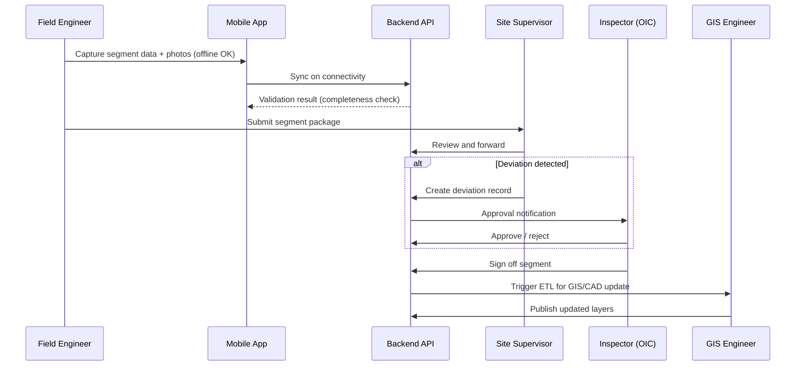

### 13.2 Fault Localization (NOC)

1. NOC receives fault ticket with approximate location or OTDR distance reading.
2. NOC queries Digital ABD by chainage, coordinates, or nearest closure.
3. System returns route map, nearest manholes/closures, crossing details, and any nearby deviations.
4. Field Repair Team dispatched with ABD package (map + photos + crossing protection details).
5. Post-repair: fault linked to ABD record for MTTR tracking.

### 13.3 Brownfield Onboarding

1. Import legacy CAD/shapefiles and scanned ABD documents.
2. GIS engineer validates and georeferences imported layers.
3. Gaps flagged as "legacy — incomplete" with remediation tasks assigned.
4. Legacy and new records coexist under unified project/route hierarchy.

---

## 14. Compliance & Regulatory Alignment

Digital ABD shall support validation against applicable **TEC (Telecommunication Engineering Centre)** and **DoT (Department of Telecommunications)** specifications, including but not limited to:

| Area | Compliance Checkpoint | ABD Record Required |
|---|---|---|
| Trenching depth | Meets minimum depth per surface/road type | TrenchRecord.depth_m + photo |
| Duct type & sizing | Matches approved design specification | DuctRecord + design comparison |
| HDD crossings | Approved method, depth, pipe spec | HDDCrossing + approval ref |
| Railway/highway crossings | Protection measures per spec | Crossing record + photos |
| Joint closures | Accessible, sealed, tested | JointClosure + OTDRTest |
| Reinstatement | Surface restored per standard | TrenchRecord.reinstatement_status + after-photo |
| Deviations | Documented and approved before sign-off | Deviation + ApprovalAction chain |

The system shall generate **Compliance Summary Reports** per route segment indicating pass/fail per checkpoint.

---

## 15. Security & Access Control

### 15.1 Role Definitions

| Role | Permissions |
|---|---|
| `field_engineer` | Create/edit own segment records; upload photos; cannot approve |
| `site_supervisor` | Review and submit team records; create deviation drafts |
| `inspector_oic` | Approve/reject deviations; sign off segments; read all project data |
| `gis_engineer` | Manage layers, ETL jobs, CAD exports; read all spatial data |
| `noc_operator` | Read-only route/asset lookup; no edit |
| `program_manager` | Read all; access dashboards and reports; no edit on field data |
| `auditor` | Read-only; export audit packages; access full audit trail |
| `vendor_admin` | Manage vendor users; read vendor-scoped projects |
| `system_admin` | Full configuration; user/role management; no field data edit |

### 15.2 Security Controls

- Principle of least privilege via RBAC
- Project-level and vendor-level data isolation
- Session timeout: 30 minutes (web), 24 hours (mobile with re-auth for approvals)
- All approval actions require authenticated identity (MFA for OIC and admin)
- File uploads scanned for malware; EXIF metadata preserved for photos
- Penetration testing before production go-live

> **Note:** Sections 15.1–15.2 define baseline access control. For the full enterprise security program, see [Section 31 — Enterprise Security Framework](#31-enterprise-security-framework).

---

## 16. Implementation Framework

### Phase 1 – Planning

- Define ABD standards aligned with DoT/TEC specifications
- Select digital tools (GIS, AutoCAD, cloud repository)
- Vendor onboarding with ABD compliance clauses
- Finalize data model, API contracts, and RBAC matrix

### Phase 2 – Execution

- Deploy mobile app and backend API
- Capture trenching, ducting, and splicing data in real time
- Upload geo-tagged photographic evidence to cloud
- Integrate OTDR test results into ABD records

### Phase 3 – Digitization

- Convert field records into GIS maps and AutoCAD drawings
- Metadata tagging for route, manholes, closures, and crossings
- Centralized repository with controlled stakeholder access
- Brownfield data import (if applicable)

### Phase 4 – Governance Integration

- Link ABD data to SLA dashboards (availability, MTBF/MTTR)
- Enable RCA automation and fault localization
- Escalation matrices referencing ABD deviations
- User acceptance testing and production cutover

---

## 17. Project Plan & Schedule

### 17.1 Timeline Overview

| Phase | Duration | Key Activities | Deliverables |
|---|---|---|---|
| **Phase 1 – Planning** | Weeks 1–2 | Standards, vendor onboarding, tool selection, API design | ABD standards doc, vendor contracts, tool selection report, API spec |
| **Phase 2 – Execution** | Weeks 3–6 | Field data capture, mobile app rollout, OTDR integration | Field data logs, photo repository, OTDR integration |
| **Phase 3 – Digitization** | Weeks 7–9 | GIS conversion, metadata tagging, repository setup | GIS maps, AutoCAD drawings, metadata repository |
| **Phase 4 – Governance** | Weeks 10–12 | SLA dashboards, RCA workflows, UAT, go-live | Dashboard integration, governance toolkit, training completion |

### 17.2 Milestones

| Milestone | Target | Exit Criteria |
|---|---|---|
| M1: Foundation Ready | End of Week 2 | Standards approved; environments provisioned; API spec v1 published |
| M2: Field Pilot Live | End of Week 4 | Mobile app deployed; ≥ 1 pilot route segment captured end-to-end |
| M3: GIS/CAD Pipeline | End of Week 9 | Automated ETL producing validated GIS layers and CAD drawings |
| M4: Production Go-Live | End of Week 12 | UAT passed; NOC integration live; training completed; SLA dashboards active |

### 17.3 Gantt Overview

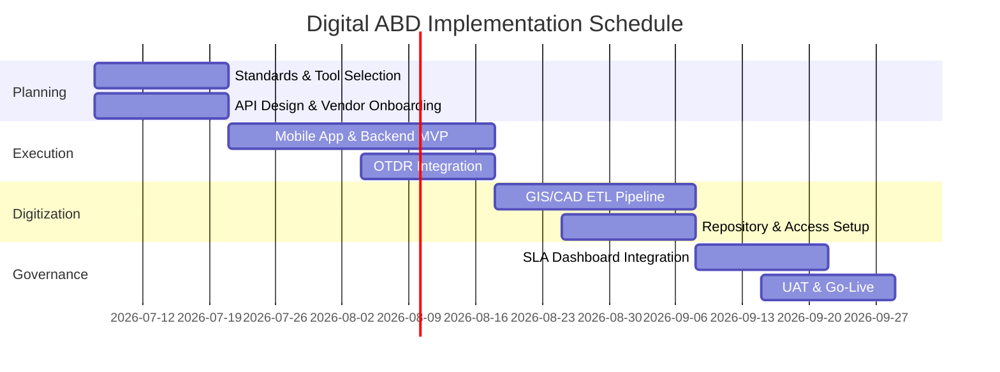

---

## 18. Team & Responsibilities

### 18.1 Core Technical Team (4 resources)

| Role | Count | Responsibilities |
|---|---|---|
| **Business Analyst** | 1 | Requirements management, process mapping, change control, UAT coordination |
| **Backend Developer** | 1 | Node.js API, PostgreSQL/PostGIS, ETL integration, NOC webhooks |
| **Frontend Developer** | 1 | Angular/React portal, map visualization, dashboard UI |
| **DevOps / Security & IAM** | 1 | CI/CD, Kubernetes, cloud infra, IAM, security hardening |

### 18.2 Extended Team (as needed)

| Role | Involvement |
|---|---|
| GIS/CAD Engineer | Phase 3; layer design, ETL validation |
| Mobile Developer | Phase 2; may be shared with frontend developer in small team |
| QA Engineer | Phase 2–4; test automation, field pilot support |
| Program Manager | All phases; stakeholder communication, vendor coordination |

*Figure 2: Core team structure and responsibilities*

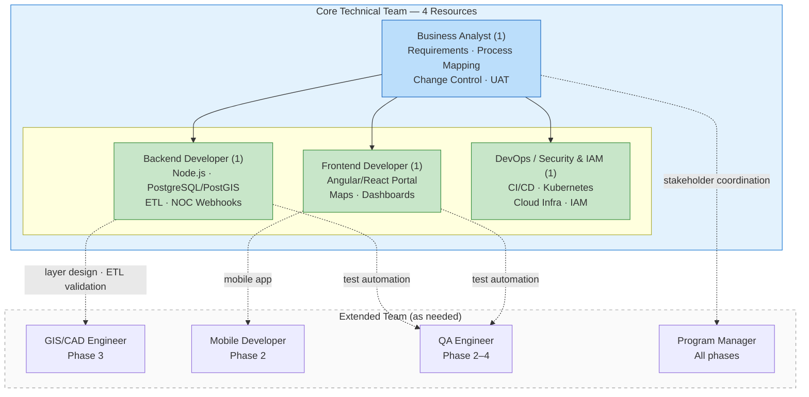

---

## 19. Deliverables & Acceptance Criteria

### 19.1 Deliverables

| # | Deliverable | Phase |
|---|---|---|
| D-01 | ABD Standards Document (aligned to TEC/DoT) | 1 |
| D-02 | API Specification (OpenAPI 3.0) | 1 |
| D-03 | Mobile Field Application (iOS + Android) | 2 |
| D-04 | Backend API and Database (PostgreSQL + PostGIS) | 2 |
| D-05 | Object Storage Repository (photos, CAD, OTDR) | 2 |
| D-06 | GIS Layers and AutoCAD As-Built Drawings | 3 |
| D-07 | Web Portal with Search and Compliance Reports | 3 |
| D-08 | SLA Dashboard Integration | 4 |
| D-09 | Governance Toolkit (checklists, escalation matrices) | 4 |
| D-10 | Training Modules and User Documentation | 4 |
| D-11 | Enterprise Security Assessment & Penetration Test Report | 4 |
| D-12 | SRE Runbooks & Observability Dashboards | 4 |
| D-13 | Data Governance Policy & Data Catalog | 3 |
| D-14 | DR Plan & Failover Test Report | 4 |
| D-15 | API Developer Portal & SDK | 3 |
| D-16 | Tenant Provisioning & SCIM Integration Guide | 2 |
| D-17 | Compliance & Certification Readiness Package | 4 |
| D-18 | Performance Test Report (load, stress, soak) | 4 |
| D-19 | Incident Response Plan & Support Playbooks | 4 |
| D-20 | Architecture Decision Records (ADR) Register | 1 |

### 19.2 Acceptance Criteria (Go-Live)

- [ ] ≥ 95% of mandatory ABD fields capturable via mobile app
- [ ] End-to-end workflow demonstrated: field capture → approval → GIS publication
- [ ] NOC integration returns asset data within 3 seconds for test fault scenarios
- [ ] RBAC verified: each role can only perform authorized actions
- [ ] Audit package export validated by QA/Inspector persona
- [ ] Security review and penetration test completed with no critical findings
- [ ] Training completed for ≥ 90% of field and supervisor users
- [ ] SLA dashboard displaying live completeness and MTTR metrics

**Enterprise acceptance criteria (Phase 4):**

- [ ] Multi-tenant isolation verified: penetration test confirms no cross-tenant data access
- [ ] SLO dashboards operational; 30-day baseline established for all platform SLOs
- [ ] DR failover drill completed successfully within RTO target (≤ 1 hour)
- [ ] All P0 API endpoints documented in OpenAPI 3.0 and published to developer portal
- [ ] Kafka event catalog implemented; ≥ 3 enterprise consumers verified (NOC, DWH, Notification)
- [ ] SCIM provisioning tested with enterprise IdP (create, update, deprovision lifecycle)
- [ ] Security: zero critical/high open vulnerabilities; MFA enforced for all privileged roles
- [ ] Observability: all services emitting logs, metrics, traces; PagerDuty integration active
- [ ] Data governance: data catalog populated; quality rules enforced; retention policies configured
- [ ] Performance: load test passed at 500 concurrent users meeting all SLO targets
- [ ] UAT traceability matrix: 100% of P0 FR-xxx requirements verified
- [ ] ISO 27001 gap assessment completed with remediation plan for remaining items

---

## 20. Risks, Assumptions & Dependencies

### 20.1 Risks

| Risk | Impact | Likelihood | Mitigation |
|---|---|---|---|
| Poor field connectivity delays sync | Medium | High | Offline-first mobile app; configurable sync retry |
| GPS inaccuracy in urban canyons | High | Medium | External antenna support; post-processing; accuracy metadata |
| Vendor resistance to digital workflow | High | Medium | Training, contractual compliance clauses, phased rollout |
| Legacy data quality too poor to georeference | Medium | Medium | Flag as incomplete; assign remediation; don't block new captures |
| Scope creep (blockchain, advanced analytics) | Medium | High | Phase features; P0/P1/P2 prioritization; change control via BA |
| Small team capacity (4 FTE) | High | High | Strict MVP scope; defer P2; consider contractor for mobile; Phase 2+ team expansion plan |
| Multi-tenant data leakage | Critical | Low | RLS, integration tests, annual penetration test, bug bounty program |
| Enterprise IdP integration complexity | Medium | Medium | Early IdP engagement; SCIM sandbox testing in Phase 1 |
| Kafka operational overhead | Medium | Medium | Managed Kafka service (MSK/Event Hubs); SRE training |
| Data residency non-compliance | High | Low | India-region lock; legal review of cross-border policies |
| Certificate / compliance audit failure | High | Medium | Early gap assessment; compliance officer engagement in Phase 2 |
| Vendor API contract changes | Medium | Medium | Adapter pattern; versioned integration layer; contract tests |

### 20.2 Dependencies

- Cloud infrastructure provisioned and IAM configured before Week 2
- Approved design drawings available before field capture begins
- NOC team provides API specs or webhook endpoints by Week 8
- Vendor contracts include ABD digital submission obligations

---

- Vendor contracts include ABD digital submission obligations

---

## 23. Enterprise Architecture Principles

Digital ABD adheres to the following enterprise architecture principles. All design decisions must be evaluated against these principles; deviations require Architecture Review Board (ARB) approval.

| # | Principle | Description |
|---|---|---|
| 1 | **API-First** | All capabilities exposed via versioned APIs before UI; no backdoor data access |
| 2 | **Event-Driven** | State changes published as domain events; consumers decoupled from producers |
| 3 | **Cloud-Native** | Containerized, horizontally scalable, infrastructure as code, 12-factor app compliance |
| 4 | **Security by Design** | Zero-trust network, least privilege, encryption everywhere, threat modeling per release |
| 5 | **Multi-Tenant by Default** | Logical isolation at every layer; no single-tenant shortcuts in core platform |
| 6 | **Observable** | If it runs in production, it emits logs, metrics, and traces |
| 7 | **Resilient** | Graceful degradation, circuit breakers, retry with backoff, no single points of failure |
| 8 | **Data as an Asset** | Governed, classified, lineage-tracked, quality-scored, with defined ownership |
| 9 | **Configurable over Custom** | Tenant-specific behavior via configuration and feature flags, not code forks |
| 10 | **Buy over Build** | Prefer managed cloud services for undifferentiated infrastructure (auth, messaging, storage) |

### 23.1 Architecture Review Board (ARB)

- **Cadence**: Bi-weekly during build; monthly in steady state
- **Participants**: Solution Architect, CISO delegate, Lead Backend, DevOps Lead, Business Analyst
- **Gate criteria**: ADR documented, security review completed, NFR impact assessed, rollback plan defined

---

## 24. Multi-Tenancy & Organizational Hierarchy

### 24.1 Tenant Hierarchy

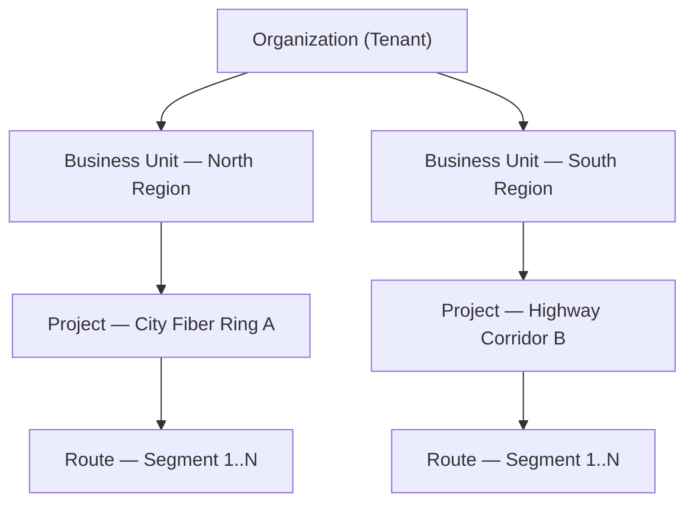

### 24.2 Isolation Model

| Layer | Isolation Mechanism |
|---|---|
| **API** | Tenant ID (`org_id`) in JWT claims; gateway enforces scope on every request |
| **Application** | Tenant context propagated via request middleware; no global queries without tenant filter |
| **Database** | Row-level security (RLS) on PostgreSQL; `org_id` column on all tenant-scoped tables |
| **Object Storage** | Per-tenant bucket prefixes with IAM policies |
| **Cache** | Tenant-prefixed Redis keys; TTL per tenant configurable |
| **Search** | Elasticsearch index per tenant (or alias with filtered alias for cost optimization) |
| **Events** | Kafka topic prefix per tenant: `org.{org_id}.abd.*` |

### 24.3 Tenant Provisioning

1. Enterprise Admin submits tenant provisioning request (org name, region, admin contact, tier).
2. Platform auto-provisions: database schema + RLS policies, storage prefix, Kafka topics, IdP group mapping.
3. Default configuration applied: retention policy, notification templates, compliance checklist template.
4. Tenant admin invited via SCIM or manual onboarding email.
5. Provisioning audit log entry created; Data Steward assigned.

### 24.4 Tenant Tiers

| Tier | Projects | Users | Storage | Support | SLA |
|---|---|---|---|---|---|
| **Standard** | ≤ 10 | ≤ 50 | 500 GB | Business hours | 99.5% |
| **Professional** | ≤ 50 | ≤ 200 | 5 TB | 12×5 | 99.9% |
| **Enterprise** | Unlimited | Unlimited | Custom | 24×7 | 99.95% |

---

## 25. Service Level Objectives

### 25.1 Platform SLOs

| SLI | SLO Target | Measurement Window | Error Budget |
|---|---|---|---|
| API availability | 99.9% | 30-day rolling | 43.2 min/month |
| API latency (p99 read) | ≤ 500 ms | 30-day rolling | 1% of requests may exceed |
| API latency (p99 write) | ≤ 1,000 ms | 30-day rolling | 1% of requests may exceed |
| Mobile sync success rate | ≥ 99% | 7-day rolling | 1% sync failures allowed |
| Photo upload success | ≥ 98% | 7-day rolling | 2% failures (resumable upload) |
| ETL pipeline completion | ≥ 99% within SLA window | Per job | 1% jobs may exceed window |
| Search query (p95) | ≤ 2 seconds | 30-day rolling | 5% may exceed |

### 25.2 Business SLOs

| SLI | SLO Target | Owner |
|---|---|---|
| ABD completeness at sign-off | ≥ 95% mandatory fields | Program Manager |
| Deviation approval turnaround | ≤ 3 business days (median) | OIC / Site Supervisor |
| NOC asset lookup response | ≤ 3 seconds | Platform / NOC Integration |
| Audit package generation | ≤ 5 minutes for 100 km route | Platform |
| DR failover completion | ≤ 1 hour (RTO) | SRE / DevOps |

### 25.3 SLA Escalation Matrix

| Severity | Condition | Response Time | Resolution Target | Escalation |
|---|---|---|---|---|
| **P1 — Critical** | Platform down; no workaround | 15 min | 4 hours | SRE → Engineering Manager → CTO |
| **P2 — High** | Major feature degraded; workaround exists | 30 min | 8 hours | SRE → Team Lead |
| **P3 — Medium** | Minor feature impact | 4 hours | 3 business days | Support → SRE |
| **P4 — Low** | Cosmetic / enhancement | 1 business day | Next release | Product backlog |

---

## 26. High Availability & Disaster Recovery

### 26.1 Production Topology

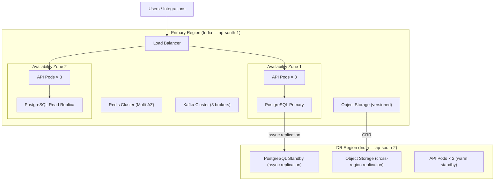

### 26.2 HA Design Requirements

| Component | HA Strategy | Failover |
|---|---|---|
| API Gateway | Multi-AZ, auto-scaling (min 3 instances) | Automatic via load balancer health checks |
| Application Pods | Kubernetes HPA; min 3 replicas per service | Pod restart + rolling deployment |
| PostgreSQL | Primary + synchronous replica (same region) + async standby (DR region) | Automated failover via Patroni / cloud managed failover |
| Redis | Cluster mode, multi-AZ | Automatic shard failover |
| Kafka | 3+ brokers, replication factor 3 | Leader election on broker failure |
| Object Storage | Multi-AZ + cross-region replication | DNS failover to DR bucket |
| Elasticsearch | 3-node cluster, replica shards | Automatic shard reallocation |

### 26.3 Backup Strategy

| Data Store | Backup Method | Frequency | Retention | Recovery Test |
|---|---|---|---|---|
| PostgreSQL | Continuous WAL + daily full snapshot | Continuous / Daily | 35 days PITR | Monthly |
| Object Storage | Versioning + cross-region replication | Continuous | 10 years (lifecycle policy) | Quarterly |
| Elasticsearch | Snapshot to object storage | Daily | 30 days | Quarterly |
| Kafka | Topic retention + mirror to DR | 7-day retention | 7 days | Semi-annual |
| Configuration (IaC) | Git repository (source of truth) | Every commit | Indefinite | Every deployment |

### 26.4 DR Runbook Summary

1. **Detection**: Automated health check failure triggers P1 alert to SRE on-call.
2. **Assessment**: SRE confirms scope (AZ failure vs. region failure) within 15 minutes.
3. **Decision**: DR lead authorizes failover for region-level failure.
4. **Failover**: DNS cutover to DR region; promote PostgreSQL standby; activate warm API pods.
5. **Validation**: Smoke tests on critical paths (auth, segment lookup, photo retrieval, NOC API).
6. **Communication**: Status page update; stakeholder notification per incident comms plan.
7. **Failback**: Planned failback after primary region restoration; data reconciliation verified.

**DR drill cadence**: Full failover drill quarterly; tabletop exercise monthly.

---

## 27. Observability & Site Reliability Engineering

### 27.1 Observability Pillars

| Pillar | Implementation | Key Signals |
|---|---|---|
| **Metrics** | Prometheus → Grafana | Request rate, error rate, duration (RED); CPU, memory, disk (USE) |
| **Logs** | Structured JSON → Loki/ELK | Request ID, tenant ID, user ID, action, duration, status |
| **Traces** | OpenTelemetry → Jaeger/Tempo | End-to-end request path across API, DB, cache, Kafka |
| **Alerts** | Grafana Alerting → PagerDuty | SLO burn rate, error spikes, latency anomalies, disk usage |

### 27.2 Key Dashboards

| Dashboard | Audience | Panels |
|---|---|---|
| **Platform Health** | SRE | Uptime, error rate, p50/p95/p99 latency, pod restarts, DB connections |
| **SLO Burn Rate** | SRE, Engineering Manager | Error budget remaining, burn rate alerts, SLA compliance |
| **Tenant Activity** | Enterprise Admin | Active users, API calls, storage usage, sync failures per tenant |
| **Business Operations** | Program Manager | ABD completeness, deviation backlog, approval turnaround |
| **Security** | CISO / Security | Failed auth attempts, privilege escalations, anomalous API patterns |
| **Capacity** | SRE, DevOps | CPU/memory trends, storage growth, DB size, Kafka lag |

### 27.3 Alerting Rules (Examples)

| Alert | Condition | Severity | Action |
|---|---|---|---|
| API Error Rate High | 5xx > 1% for 5 min | P1 | Page SRE on-call |
| API Latency Degraded | p99 > 2s for 10 min | P2 | Notify SRE channel |
| DB Replication Lag | > 30 seconds | P2 | Investigate; potential failover risk |
| Disk Usage Critical | > 85% | P2 | Scale storage; review retention |
| Kafka Consumer Lag | > 10,000 messages for 15 min | P3 | Scale consumers |
| Certificate Expiry | < 14 days | P3 | Auto-renew or manual renewal |
| SLO Budget Exhausted | > 80% error budget consumed | P2 | Engineering review; freeze non-critical deploys |

### 27.4 SRE Runbooks

Each production service shall have a runbook covering:

- Service description and dependencies
- Common failure modes and diagnostic steps
- Rollback procedure
- Escalation contacts
- Communication templates

Runbooks stored in the ops repository; linked from Grafana dashboards.

---

## 28. Event-Driven Architecture

### 28.1 Event Flow

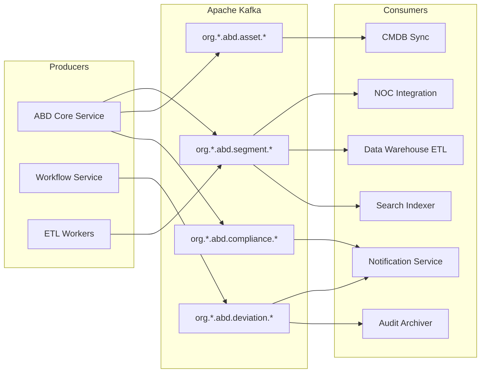

### 28.2 Event Contract Standards

- **Schema**: Avro or JSON Schema registered in Schema Registry; backward-compatible evolution only
- **Envelope**: `{ event_id, event_type, event_version, timestamp, org_id, correlation_id, payload }`
- **Ordering**: Per-partition ordering by `segment_id` or `asset_id` key
- **Delivery**: At-least-once; consumers must be idempotent
- **Dead Letter Queue**: Failed messages after 3 retries routed to DLQ; SRE alerted
- **Retention**: 7 days hot; archived to object storage for 1 year

### 28.3 Async Processing Patterns

| Pattern | Use Case | Implementation |
|---|---|---|
| **Event Notification** | NOC alert on segment completion | Kafka consumer → webhook to NOC |
| **Event Sourcing (Audit)** | Immutable audit trail | Audit Archiver consumes all events → append-only store |
| **CQRS (Search)** | Full-text and geo search | Search Indexer projects events into Elasticsearch |
| **Saga (Workflow)** | Multi-step approval with compensating actions | Workflow Service orchestrates via Kafka commands |
| **Bulk ETL** | GIS layer generation after sign-off | ETL Worker triggered by `segment.completed` event |

---

## 29. API Governance & Platform Standards

### 29.1 API Lifecycle

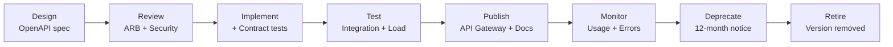

### 29.2 API Standards

| Standard | Requirement |
|---|---|
| Protocol | HTTPS only (TLS 1.2+); HTTP/2 preferred |
| Format | JSON request/response; `Content-Type: application/json` |
| Versioning | URI versioning: `/api/v1/`; header `API-Version` as fallback |
| Authentication | OAuth 2.0 (client credentials for M2M; authorization code for user flows) |
| Authorization | Scope-based: `abd:read`, `abd:write`, `abd:admin`, `abd:audit` |
| Pagination | Cursor-based: `?cursor=xxx&limit=50` |
| Filtering | Query params: `?filter[status]=completed&filter[vendor_id]=xxx` |
| Sorting | `?sort=-created_at` |
| Idempotency | `Idempotency-Key` header on all POST/PUT operations |
| Rate Limiting | Headers: `X-RateLimit-Limit`, `X-RateLimit-Remaining`, `X-RateLimit-Reset` |
| Errors | RFC 7807 Problem Details with `type`, `title`, `status`, `detail`, `instance` |
| Documentation | OpenAPI 3.0 spec auto-published to developer portal (Swagger UI / Redoc) |

### 29.3 API Tiers & Rate Limits

| Tier | Rate Limit | Burst | Concurrent Connections |
|---|---|---|---|
| Field Mobile | 100 req/min per device | 200 | 5 |
| Web Portal | 300 req/min per user | 500 | 10 |
| Integration (M2M) | 1,000 req/min per client | 2,000 | 50 |
| Enterprise Bulk | 5,000 req/min per client | 10,000 | 100 |

### 29.4 Developer Portal

- Self-service API key registration (approved by tenant admin)
- Interactive API explorer (Swagger UI)
- SDK generation (TypeScript, Python) from OpenAPI spec
- Changelog and deprecation notices
- Sandbox environment with synthetic data

---

## 30. Data Governance & Master Data Management

### 30.1 Data Governance Framework

| Domain | Data Owner | Data Steward | Policies |
|---|---|---|---|
| Route & Segment | Program Manager | GIS Engineer | Completeness rules, geo-accuracy thresholds |
| Asset Master | SCM Lead | Data Steward | Unique serial numbers, manufacturer validation |
| Compliance Records | QA / OIC | Compliance Officer | Retention, legal hold, audit export |
| User & Access | CISO | Enterprise Admin | PII handling, access reviews, deprovisioning |
| Integration Data | Integration Architect | Backend Lead | Schema contracts, data quality SLAs |

### 30.2 Data Quality Rules

| Rule ID | Entity | Validation | Action on Failure |
|---|---|---|---|
| DQ-001 | Segment | All mandatory fields populated | Block submission |
| DQ-002 | SurveyPoint | GPS accuracy ≤ 10 m (configurable) | Warning; flag for review |
| DQ-003 | TrenchRecord | Depth ≥ project minimum (default 1.65 m) | Compliance fail; block sign-off |
| DQ-004 | PhotoEvidence | EXIF timestamp within 24 hours of segment work date | Warning |
| DQ-005 | OTDRTest | Linked to valid JointClosure | Block association |
| DQ-006 | AssetMaster | Serial number unique within org | Reject duplicate |
| DQ-007 | Deviation | Justification ≥ 50 characters | Block submission |

### 30.3 Data Lineage

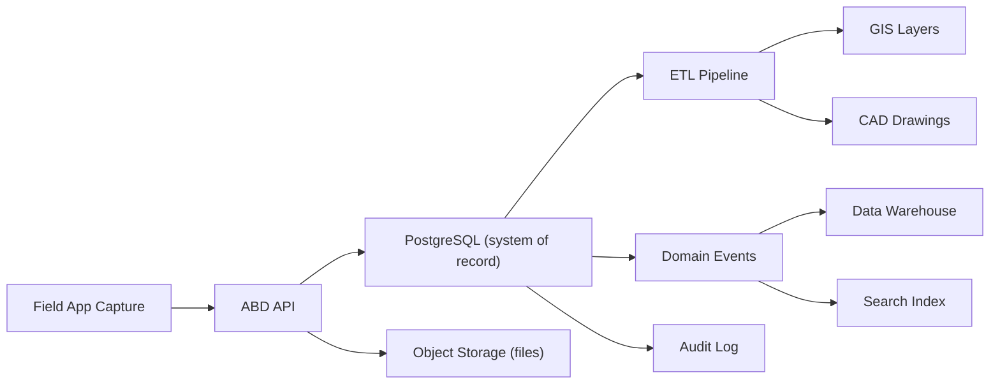

All transformations logged in `DataLineage` entity with source, target, transformation logic, and timestamp.

### 30.4 Retention & Archival

| Data Type | Active Retention | Archive | Deletion |
|---|---|---|---|
| Segment records | Life of contract + 10 years | Cold storage after 5 years | After retention period (unless legal hold) |
| Photos | 10 years | Compressed archive after 3 years | Per retention policy |
| OTDR reports | 10 years | Immediate archive to cold tier | Per retention policy |
| Audit logs | 10 years (immutable) | No deletion | Never deleted; archived only |
| Application logs | 90 days hot | 1 year cold | Auto-purged after 1 year |
| Session data | 24 hours | N/A | Auto-expired |

### 30.5 Legal Hold

- Legal hold placed by Enterprise Admin or Compliance Officer
- Hold scope: project, route, or specific entity
- All deletion and retention policies suspended for held records
- Hold release requires authorized approval with audit entry

---

## 31. Enterprise Security Framework

### 31.1 Zero-Trust Security Model

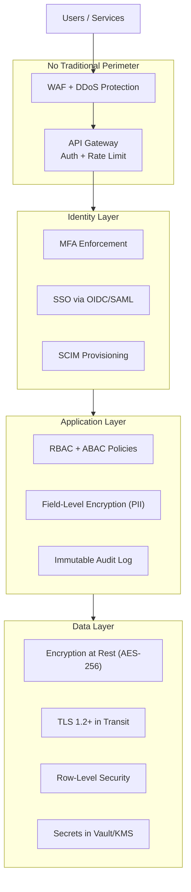

### 31.2 Security Controls Matrix

| Control Domain | Control | Implementation | Verification |
|---|---|---|---|
| **Identity** | SSO with MFA | Azure AD / Okta; conditional access policies | Quarterly access review |
| **Identity** | Automated provisioning/deprovisioning | SCIM 2.0 sync with IdP | Monthly orphan account scan |
| **Access** | Least privilege RBAC | Role-permission matrix; no shared accounts | Quarterly permission audit |
| **Access** | Privileged access management | Just-in-time elevation for admin; session recorded | PAM tool audit logs |
| **Network** | WAF + DDoS protection | Cloud WAF; rate limiting; geo-blocking (optional) | WAF rule review quarterly |
| **Network** | Service mesh (optional) | mTLS between microservices (Istio/Linkerd) | Certificate rotation automated |
| **Data** | Encryption at rest | AES-256 (cloud-managed keys or CMK) | Annual key rotation |
| **Data** | Encryption in transit | TLS 1.2+ everywhere; HSTS enabled | SSL Labs scan |
| **Data** | PII protection | Field-level encryption; data masking in non-prod | Data classification audit |
| **Application** | Input validation | Schema validation on all API inputs; OWASP Top 10 mitigations | SAST in CI pipeline |
| **Application** | File upload security | Type validation, size limits, malware scan, sandboxed storage | Penetration test |
| **Operations** | Vulnerability management | Dependabot/Snyk; CVE remediation SLAs by severity | Weekly scan reports |
| **Operations** | Incident response | Documented IR plan; 24×7 on-call for P1 security events | Annual IR drill |
| **Compliance** | Audit logging | All privileged actions logged; tamper-evident | Audit log integrity checks |

### 31.3 Vulnerability Remediation SLAs

| Severity | CVSS Score | Remediation Target | Escalation |
|---|---|---|---|
| Critical | 9.0–10.0 | 24 hours | CISO notified immediately |
| High | 7.0–8.9 | 7 days | Security team daily tracking |
| Medium | 4.0–6.9 | 30 days | Sprint planning inclusion |
| Low | 0.1–3.9 | 90 days | Backlog prioritization |

### 31.4 Security Testing Program

| Test Type | Frequency | Scope | Owner |
|---|---|---|---|
| SAST (Static Analysis) | Every CI build | Application code | DevOps |
| DAST (Dynamic Analysis) | Weekly (staging) | Running application | Security |
| Dependency Scan | Daily | All dependencies | DevOps |
| Penetration Test | Annual (+ pre-major-release) | Full platform | External firm |
| Red Team Exercise | Annual | Platform + social engineering | External firm |
| Access Review | Quarterly | All user accounts and permissions | CISO / Enterprise Admin |

---

## 32. Identity Federation & User Lifecycle

### 32.1 Authentication Flow

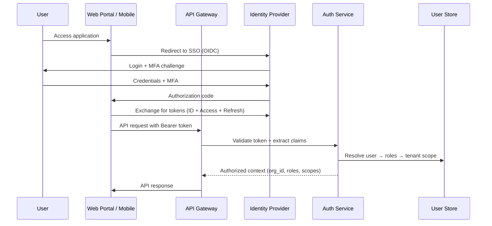

### 32.2 User Lifecycle

| Stage | Trigger | System Actions |
|---|---|---|
| **Provision** | SCIM create / Admin invite | Create user, assign roles, send welcome email, MFA enrollment |
| **Activate** | First login + MFA setup | Account active; audit log entry |
| **Role Change** | Admin action / SCIM update | Update RBAC; invalidate cached permissions |
| **Suspend** | Admin action / HR offboarding signal | Disable login; preserve data; audit log |
| **Deprovision** | SCIM delete / Admin action | Revoke tokens; anonymize PII (per policy); retain audit records |
| **Access Review** | Quarterly automated report | Manager confirms or revokes; stale accounts flagged |

### 32.3 Federation Standards

- **OIDC** for web and mobile authentication
- **SAML 2.0** for legacy enterprise IdP integration
- **SCIM 2.0** for automated user/group provisioning
- **OAuth 2.0 Client Credentials** for machine-to-machine API access
- Token lifetime: access token 15 minutes; refresh token 8 hours (web) / 30 days (mobile with device binding)

---

## 33. Deployment Topology & Environments

### 33.1 Environment Strategy

| Environment | Purpose | Data | Access | Infrastructure |
|---|---|---|---|---|
| **Development** | Feature development | Synthetic / anonymized | Engineering team | Shared; auto-deploy on merge to `develop` |
| **Staging** | Integration testing, UAT | Anonymized production snapshot (monthly refresh) | Engineering + QA + select stakeholders | Production-like; single region |
| **Pre-Production** | Release validation, load testing | Anonymized production snapshot | Engineering + SRE | Production-identical; single region |
| **Production** | Live operations | Real data | All authorized users | Multi-AZ primary + DR region |
| **Sandbox** | Vendor training, API exploration | Synthetic data (refreshed weekly) | Vendor admins + developers | Isolated tenant; minimal resources |
| **DR** | Disaster recovery | Replicated from production | SRE only (activated on failover) | Warm standby in secondary region |

### 33.2 Environment Promotion Pipeline

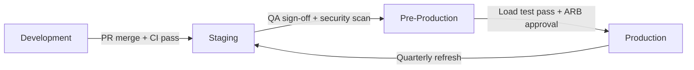

### 33.3 Network Architecture

| Zone | Components | Access |
|---|---|---|
| **Public** | CDN, WAF, Load Balancer | Internet-facing |
| **DMZ** | API Gateway | Public → Internal only |
| **Application** | Kubernetes cluster (private subnets) | Gateway → Services only |
| **Data** | Databases, Kafka, Redis, Elasticsearch (private subnets) | Application tier only |
| **Management** | Bastion, CI/CD runners, monitoring | VPN / private link only |

No direct database access from public internet. All administrative access via bastion host with session recording.

---

## 34. Capacity Planning & Performance Engineering

### 34.1 Baseline Capacity Model (Year 1)

| Resource | Initial Provisioning | Growth Trigger (Scale Out) | Max (Year 1) |
|---|---|---|---|
| API Pods | 3 per service (6 services) | CPU > 70% for 10 min | 20 per service |
| PostgreSQL | 4 vCPU, 16 GB RAM, 500 GB SSD | Storage > 70% or connections > 80% | 16 vCPU, 64 GB, 2 TB |
| Redis | 3-node cluster, 4 GB each | Memory > 75% | 3-node, 16 GB each |
| Kafka | 3 brokers, 500 GB each | Disk > 70% or consumer lag sustained | 5 brokers, 1 TB each |
| Elasticsearch | 3 nodes, 8 GB heap each | Heap > 75% or query latency degraded | 5 nodes, 16 GB heap |
| Object Storage | 1 TB | 80% utilization | 10 TB |
| ETL Workers | 2 pods | Queue depth > 100 for 5 min | 10 pods |

### 34.2 Performance Test Requirements

| Test Type | Tool | Scenario | Pass Criteria |
|---|---|---|---|
| Load Test | k6 / Gatling | 500 concurrent users, mixed read/write | p99 < SLO targets; error rate < 0.1% |
| Stress Test | k6 | 2× expected peak load | Graceful degradation; no data corruption |
| Soak Test | k6 | 72-hour sustained load at 80% peak | No memory leaks; stable latency |
| Spike Test | k6 | 0 → 500 users in 30 seconds | Auto-scaling triggers; recovery within 5 min |
| Mobile Sync Test | Custom | 100 devices syncing 50 MB offline data | ≥ 99% success within 10 min |

Performance tests executed in Pre-Production before every major release.

### 34.3 Capacity Review Cadence

- **Weekly**: SRE reviews utilization dashboards; flags services approaching thresholds
- **Monthly**: Capacity planning report to Engineering Manager (trends, forecasts, recommendations)
- **Quarterly**: Full capacity model update based on actual growth; budget forecast for infrastructure

---

## 35. Quality Assurance & Testing Strategy

### 35.1 Test Pyramid

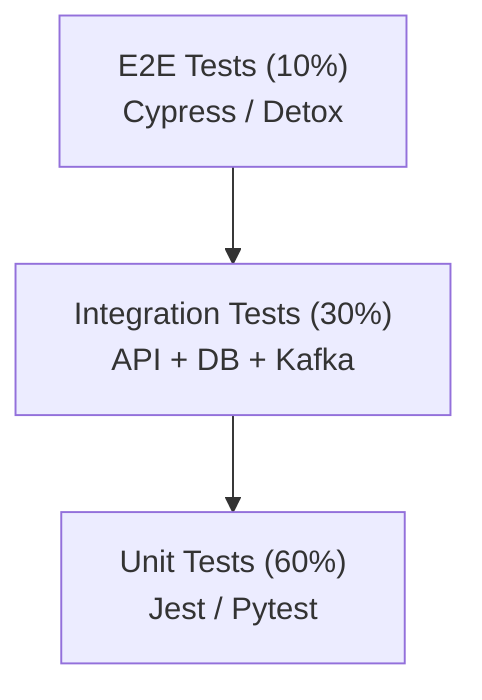

### 35.2 Test Coverage Requirements

| Layer | Coverage Target | Tools | CI Gate |
|---|---|---|---|
| Unit Tests | ≥ 80% line coverage | Jest (Node.js), Pytest (Python) | Block merge if < 80% |
| Integration Tests | All API endpoints; all Kafka consumers | Supertest, Testcontainers | Block deploy to staging if failing |
| Contract Tests | All external API integrations | Pact | Block deploy if contract broken |
| E2E Tests | Critical user journeys (10 scenarios) | Cypress (web), Detox (mobile) | Block release to production |
| Performance Tests | SLO validation | k6 | Block major release |
| Security Tests | SAST + DAST + dependency scan | SonarQube, OWASP ZAP, Snyk | Block deploy on critical/high findings |
| Accessibility Tests | WCAG 2.1 AA | axe-core | Block release on Level A violations |

### 35.3 Critical E2E Scenarios

| # | Scenario | Personas |
|---|---|---|
| 1 | Field capture offline → sync → supervisor review → OIC sign-off | Field Engineer, Supervisor, OIC |
| 2 | Deviation creation → approval workflow → GIS update | Supervisor, OIC, GIS Engineer |
| 3 | NOC fault lookup → asset retrieval → FRT dispatch package | NOC Operator |
| 4 | Bulk legacy import → georeference → gap remediation | GIS Engineer, Data Steward |
| 5 | Audit package export → compliance report validation | Auditor |
| 6 | Tenant provisioning → user onboarding → SCIM sync | Enterprise Admin |
| 7 | OTDR upload → linkage to closure → compliance check | Field Engineer, OIC |
| 8 | SLA dashboard → escalation trigger → notification delivery | Program Manager |
| 9 | API integration: segment completion event → NOC webhook | Integration (M2M) |
| 10 | DR failover → smoke test → failback | SRE |

### 35.4 UAT Process

1. UAT test plan derived from FR-xxx requirements (traceability matrix).
2. Business users execute UAT in Staging with production-like data.
3. Defects classified: Blocker (stop release), Major (fix before release), Minor (defer).
4. UAT sign-off required from Program Manager and OIC representative.
5. UAT results archived with release documentation.

---

## 36. Change Management & Release Strategy

### 36.1 Release Cadence

| Release Type | Cadence | Content | Approval |
|---|---|---|---|
| **Hotfix** | As needed | Critical bug/security fix | SRE + Team Lead |
| **Patch** | Bi-weekly | Bug fixes, minor improvements | Team Lead + QA |
| **Minor** | Monthly | New features (P1), enhancements | Product Owner + ARB |
| **Major** | Quarterly | Architecture changes, new modules | ARB + CTO |

### 36.2 Deployment Strategy

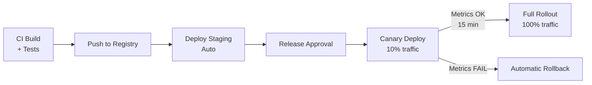

- **Blue-Green** for database migrations (with backward-compatible schema changes)
- **Canary** for application deployments (10% → 50% → 100% over 30 minutes)
- **Feature Flags** for gradual feature rollout per tenant
- **Database Migrations**: Expand-contract pattern; no destructive changes in single release

### 36.3 Change Advisory Board (CAB)

- Required for Major releases and any production infrastructure changes
- Participants: Release Manager, SRE, Security, Business Analyst, Program Manager
- Change request includes: description, risk assessment, rollback plan, test evidence, communication plan

---

## 37. Incident Management & Enterprise Support

### 37.1 Incident Response Process

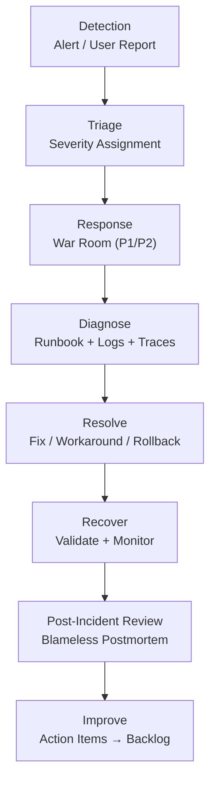

### 37.2 Support Model

| Tier | Hours | Channels | Response SLA | Scope |
|---|---|---|---|---|
| **L1 — Help Desk** | 24×7 | Email, phone, in-app chat | 30 min acknowledgment | Password reset, how-to, known issues |
| **L2 — Application Support** | 24×7 | Ticket escalation | 1 hour (P1), 4 hours (P2) | Bug investigation, data issues, integration failures |
| **L3 — Engineering** | On-call rotation | War room (P1/P2) | 15 min (P1), 30 min (P2) | Code fixes, infrastructure, security incidents |
| **L4 — Vendor / Escalation** | Business hours | Direct contact | Per vendor SLA | Third-party component failures (cloud, IdP, GIS) |

### 37.3 Post-Incident Review Template

- Incident summary (timeline, impact, duration)
- Root cause analysis (5 Whys or fishbone)
- What went well / what didn't
- Action items with owners and due dates
- SLO error budget impact
- Published internally within 5 business days of resolution

---

## 38. Regulatory & Certification Alignment

### 38.1 Regulatory Framework

| Regulation / Standard | Applicability | Platform Controls |
|---|---|---|
| **TEC / DoT Specifications** | OFC construction compliance | Compliance checklists, audit reports, deviation workflows |
| **India Data Localization** | Primary data in India region | Region-locked storage; cross-border transfer policy |
| **IT Act 2000 / DPDP Act** | Personal data protection | PII encryption, consent, right to erasure, breach notification |
| **ISO 27001** | Information security management | ISMS controls mapped to platform security framework |
| **SOC 2 Type II** | Service organization controls | Trust principles: Security, Availability, Confidentiality |
| **OWASP ASVS Level 2** | Application security verification | SAST/DAST program, secure SDLC |

### 38.2 Certification Roadmap

| Certification | Target | Phase | Key Preparation |
|---|---|---|---|
| ISO 27001 | Month 12 | Phase 4 | ISMS documentation, risk assessment, control implementation |
| SOC 2 Type II | Month 15 | Post-launch | 6-month observation period; control evidence collection |
| TEC Compliance Validation | Month 6 | Phase 2 | Compliance report templates validated with regulator |
| OWASP ASVS L2 | Month 9 | Phase 3 | Security test report; remediation of findings |

### 38.3 Compliance Reporting

| Report | Frequency | Audience | Content |
|---|---|---|---|
| ABD Compliance Summary | Per segment sign-off | OIC, Program Manager | Checkpoint pass/fail per TEC norm |
| Platform Security Posture | Monthly | CISO, CTO | Vulnerability status, access review, incident summary |
| SLA Compliance Report | Monthly | Executive Sponsor, Clients | SLO achievement, MTBF/MTTR trends, completeness scores |
| Data Governance Report | Quarterly | Data Steward, CISO | Data quality scores, lineage coverage, retention compliance |
| Audit Readiness Report | Quarterly | Compliance Officer | Audit trail completeness, legal holds, export capability test |

---

## 39. Implementation Status Addendum (v0.4)

This section aligns the FRD with the current repository implementation state (`v0.4.0`) and supersedes any older assumptions where code and this document differ.

### 39.1 Implemented Platform Scope

| Area | Current State |
|---|---|
| API | Fastify + TypeScript, OpenAPI documented in `docs/openapi.yaml` |
| Mobile | Expo app with offline queue + sync batch flow |
| Web Portal | React-based project/segment/governance workflows |
| Data | PostgreSQL + PostGIS schema through migrations `001`–`004` |
| Observability | OpenTelemetry traces/metrics/logs + SigNoz dashboards |
| Auth | Internal JWT + OIDC JWT validation (Keycloak-compatible) |
| Local Infra | Docker Compose stack (Postgres, Redis, MinIO, Redpanda, Keycloak, SigNoz, Caddy) |
| Kubernetes | Helm chart scaffold at `helm/digiabd` |
| Image Build | Packer template (`packer.pkr.hcl`) for API + web images |

### 39.2 Requirements Traceability and Test Assets

Canonical living artifacts:

- FR traceability: `docs/FR_TRACEABILITY.md`
- Test traceability matrix: `docs/TEST_MATRIX.md`
- Code execution flow: `docs/CODE_FLOW.md`
- OpenAPI contract: `docs/openapi.yaml`

Current summary from traceability matrix:

- P0: 36 total (16 implemented, 14 partial, 6 deferred)
- P1: 16 total (2 implemented, 8 partial, 6 deferred)
- P2: 2 total (0 implemented, 0 partial, 2 deferred)

### 39.3 Key Known Gaps vs FRD Targets

The following FRD capabilities remain partial/deferred in current code and must be treated as open work items:

- FR-006 HDD crossing capture API
- FR-010 OTDR file upload endpoint
- FR-023 planned-vs-actual GIS overlay
- FR-032 record versioning
- FR-033 ZIP/PDF audit package export
- FR-041 shapefile/KML export
- FR-042 production-grade CAD generation (currently placeholder artifact)
- FR-061 configurable mandatory checklists by project type
- FR-074 retention/legal hold policy enforcement
- FR-090 email/SMS channel (in-app only currently)

### 39.4 Runtime Deployment References

- Local stack: `docker-compose.yml`
- Reverse proxy: `Caddyfile` + `docs/CADDY.md`
- Helm deployment: `docs/HELM.md`
- Packer image build: `docs/PACKER.md`
- Operations and observability: `docs/OBSERVABILITY.md`

### 39.5 Document Governance

- `spec.md` remains the normative functional and non-functional intent.
- `docs/FR_TRACEABILITY.md` is the source of truth for "implemented vs partial vs deferred".
- Any future FR status change must update:
  1. `docs/FR_TRACEABILITY.md`
  2. `docs/TEST_MATRIX.md`
  3. `spec.md` Revision History table

---

## 21. Glossary

| Term | Definition |
|---|---|
| **ABD** | As-Built Documentation — record of actual construction vs. design |
| **OFC** | Optical Fiber Cable |
| **HDD** | Horizontal Directional Drilling — trenchless crossing method |
| **OTDR** | Optical Time-Domain Reflectometer — fiber test equipment |
| **MTBF** | Mean Time Between Failures |
| **MTTR** | Mean Time To Repair |
| **TEC** | Telecommunication Engineering Centre (India) |
| **DoT** | Department of Telecommunications (India) |
| **OIC** | Officer-in-Charge — authorized inspector for approvals |
| **FRT** | Field Repair Team |
| **NOC** | Network Operations Center |
| **SCM** | Supply Chain Management |
| **RCA** | Root Cause Analysis |
| **DWC** | Double Wall Corrugated (duct type) |
| **HDPE** | High-Density Polyethylene (duct material) |
| **Chainage** | Distance along route from origin, in meters |
| **SLA** | Service Level Agreement |
| **SLO** | Service Level Objective — measurable target underlying an SLA |
| **SLI** | Service Level Indicator — metric used to measure an SLO |
| **RPO** | Recovery Point Objective — maximum acceptable data loss window |
| **RTO** | Recovery Time Objective — maximum acceptable downtime during recovery |
| **RBAC** | Role-Based Access Control |
| **ABAC** | Attribute-Based Access Control |
| **SSO** | Single Sign-On |
| **SCIM** | System for Cross-domain Identity Management |
| **OIDC** | OpenID Connect |
| **MFA** | Multi-Factor Authentication |
| **WAF** | Web Application Firewall |
| **CDN** | Content Delivery Network |
| **ETL** | Extract, Transform, Load |
| **CQRS** | Command Query Responsibility Segregation |
| **DLQ** | Dead Letter Queue |
| **PITR** | Point-in-Time Recovery |
| **ISMS** | Information Security Management System |
| **SIEM** | Security Information and Event Management |
| **CMDB** | Configuration Management Database |
| **ITSM** | IT Service Management |
| **PII** | Personally Identifiable Information |
| **DPDP** | Digital Personal Data Protection Act (India) |
| **ADR** | Architecture Decision Record |
| **ARB** | Architecture Review Board |
| **CAB** | Change Advisory Board |
| **SRE** | Site Reliability Engineering |
| **IaC** | Infrastructure as Code |
| **CMK** | Customer-Managed Key (encryption) |

---

## 22. Revision History

| Version | Date | Author | Changes |
|---|---|---|---|
| 1.0 | 2026-07-07 | Digital ABD Program Team | Initial FRD draft |
| 1.1 | 2026-07-07 | Digital ABD Program Team | Enhanced with functional/non-functional requirements, data model, architecture diagrams, workflows, security, risks, and acceptance criteria |
| 1.2 | 2026-07-07 | Digital ABD Program Team | Replaced Figure 1 and Figure 2 PNG references with Mermaid diagrams |
| 2.0 | 2026-07-07 | Digital ABD Program Team | Enterprise-grade enhancement: multi-tenancy, SLO/SLA, HA/DR, observability, event-driven architecture, API governance, data governance, zero-trust security, identity federation, deployment topology, capacity planning, testing strategy, change management, incident management, regulatory alignment |
| 2.1 | 2026-07-08 | Digital ABD Program Team | Added implementation status addendum for v0.4, linked traceability/test artifacts, and documented current open FR gaps |
